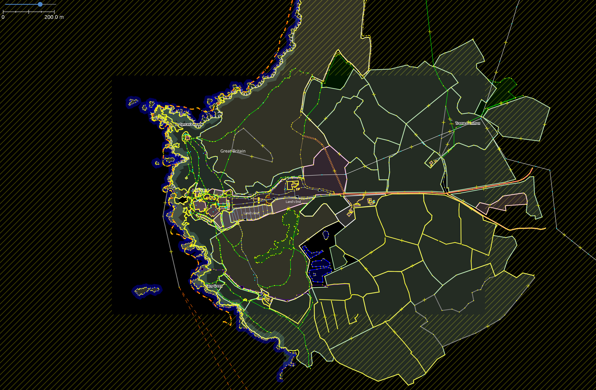
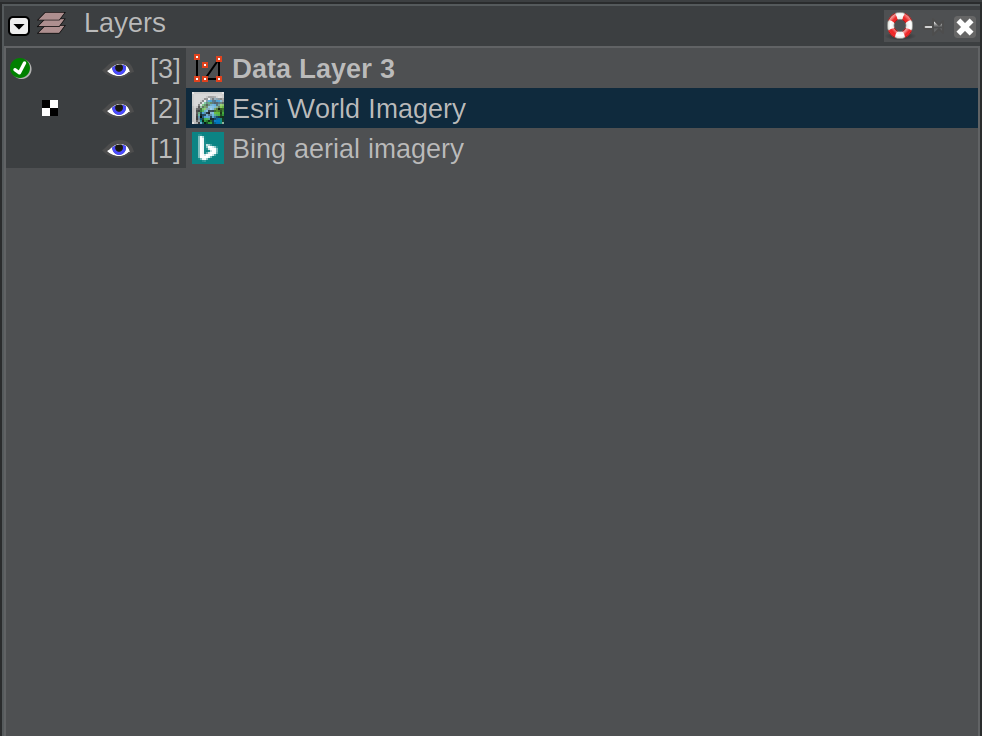
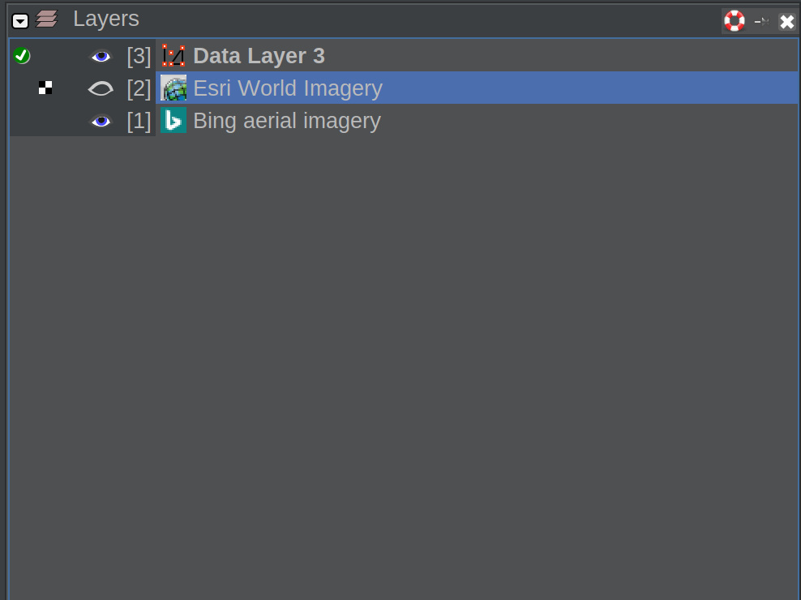

Imagery enables you to transform your map into something that actually looks like a map! 

It will transform this:

into this: 

Much better! We can now see fields, a coastline and much more! 

The above images and all other media in this project uses the Bing imagery layer. This is a very high quality imagery whilst also being relatively up to date in most parts of the developed world. The Esri world imagery is also a good option. A full list of imagery sources can be found [here](https://josm.openstreetmap.de/wiki/Maps#Listofsources).

## Changing/activating imagery

The easiest way to do this is to go to the 'Imagery' section of the main window. 

and select your imagery from there. You can also access the imagery preferences and other, less used imagery layers here. 

## Multiple imagery layers

Read more about Layers in general [here](Layers.md)

You can actually have multiple imagery layers at once to ease switching back and forth if you require. 

Go to the 'Layers' window (usually in the top right of the screen). See [here](Layers.md) if you cannot see the window. 

Right now I only have one Imagery layer present and active, that being the Bing layer, as seen in the above images of Land's End.

After selecting Esri in the Imagery section of the main window, I have both Bing and Esri. 

The uppermost Imagery layer will be rendered:

This is the same area, just with Esri, not Bing. See how it looks different, yet the same? 

However, if I hide the Esri layer:

now my map has gone back to Bing, because it is the uppermost, visible Imagery layer. 

Pretty simple stuff. Experiment and find what works for you in the area you plan to map in.
