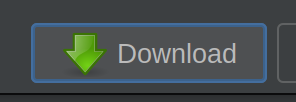

# Downloading the map

Once you have opened JOSM, you should be met with an image similar to this: 

## Do not worry!

This looks like a lot but trust me, it is not. This is mostly news and translation requests. It is not relevant for this section.

## Getting the map

You may notice that this does not look like a map. That's because we need to download a section of the map first so we can work on it. 

Head up to the toolbar at the top of the page and click the 'Download' button (the green arrow pointing downwards), or press `Ctrl+Shift+Down` on your keyboard.

This will bring up the 'Download' screen in a separate window: 

All we care about right now is grabbing some map data. Zoom with your scroll wheel and pan by dragging with right click. Highlight a square by dragging with left click, as seen below.

Make sure it's not too large of a selection (the OSM servers will only let you download up to around 1MB of data. Do not worry, this is plenty for anything you need to do at this stage.)

Press the 'Download' button at the bottom of this window to download the map area you have just selected.

